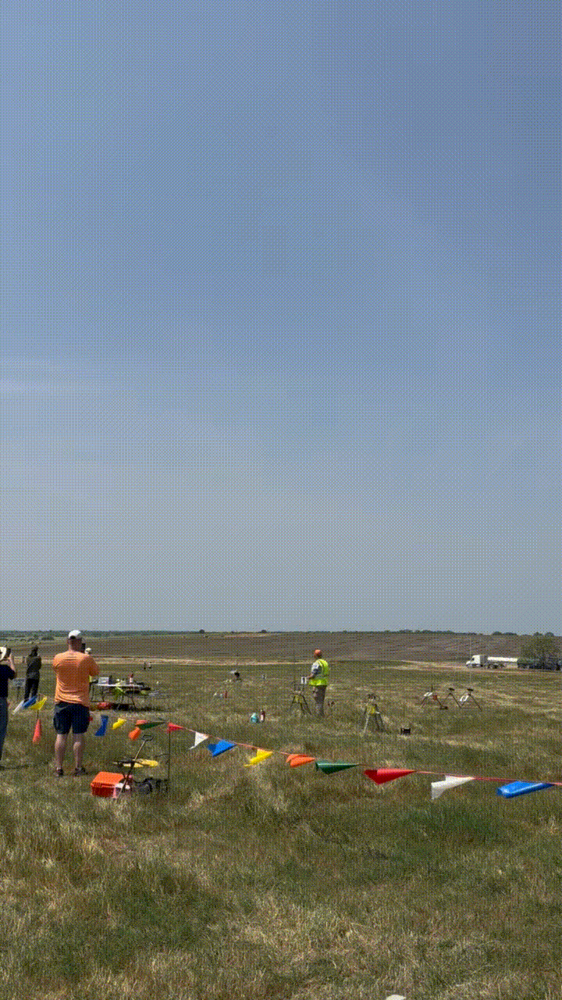

<h1 align="center">Tyree Franklin Jr.</h1>
<h3 align="center">RF Software • Embedded Systems • Real-Time C++ / Rust / Linux</h3>

<p align="center">
  <a href="https://www.linkedin.com/in/tyree-franklin-jr/">
    
  </a>
  <a href="mailto:tyree.franklinjr@gmail.com">
    
  </a>
  <a href="https://github.com/tyreefranklinjr">
    
  </a>
</p>

<p align="center">
  I build performance-critical software at the <b>RF / systems boundary</b>:
  SDR/DSP pipelines, resilient communications, embedded autonomy, and hardware/software integration.
</p>

<p align="center">
  <b>U.S. Citizen</b> • Fort Worth, TX • B.S. Computer Science @ WGU
</p>

---

## RF / Systems Snapshot

|                                                          |                                                |
| -------------------------------------------------------- | ---------------------------------------------- |
| **1.024 MS/s** IQ throughput                             | **< 4 ms p99** DSP latency                     |
| **99.99%** block delivery over 60 min                    | **0 steady-state heap allocations** in DSP critical path |
| **4096-point FFT** deterministic RF validation           | **< 250 ms** communications failover           |
| **100%** safe-state transition success                   | **500+** automated SIL/HIL fault scenarios     |

<p align="center">
  
</p>
<p align="center">
  <sub>Novus Rocketry Team, Top 100 nationally. Served as Club Officer, 2025.</sub>
</p>

---

## Algorithms & Systems I Implement

```text
IQ samples
   ↓
Bounded queue (backpressure)
   ↓
FFT / DSP core
   ↓
Metrics: p99 latency, block delivery
```

**DSP / RF Processing**
`FFT` · `IQ Processing` · `RTL-SDR` · `Deterministic RF Validation`

**Real-Time Systems**
`Bounded SPSC Queues` · `Backpressure` · `Zero-Allocation Critical Paths` · `IQ Record/Replay` · `Rust/Tokio Supervision` · `Injected Failure Scenarios`

**Embedded / Autonomy**
`FreeRTOS` · `CAN/TWAI` · `I2C` · `UART` · `EKF Sensor Fusion` · `PID Control` · `A* Planning` · `Watchdogs` · `Mission-State Management`

**Resilient Communications**
`Sequence Tracking` · `ACK/Retry` · `Duplicate Suppression` · `Link Scoring` · `Priority Queues` · `Automatic Failover`

---

## RF Validation

<p align="center">
  <a href="https://github.com/tyreefranklinjr/TeleComms--Software-Defined-Comms">
    
  </a>
</p>
<p align="center">
  <sub>
    Measured p99 latency, block delivery, and FFT spectrum from an actual run of the SDR pipeline.
  </sub>
</p>
<p align="center">
  <a href="https://github.com/tyreefranklinjr/TeleComms--Software-Defined-Comms">
    <b>View the SDR processing platform →</b>
  </a>
</p>

---

## Selected Engineering Work

### Real-Time Software-Defined Communications and RF Processing Platform
<sub>Jun 2026</sub>
`C++20` `C` `Rust` `Python` `Linux` `RTL-SDR` `DSP` `FFTW` `CMake/Ninja` `Nix` `Docker`

* Engineered a real-time SDR processing stack sustaining **1.024 MS/s IQ throughput** with **<4 ms p99 DSP latency**, implementing bounded SPSC queues, explicit backpressure, and zero steady-state heap allocation in the critical processing path.
* Built deterministic RF validation infrastructure with IQ record/replay, **4096-point FFT analysis**, Rust/Tokio supervision, and injected failure scenarios, maintaining **99.99% block delivery** during 60-minute endurance runs.

### Resilient Autonomous Mission Computer and Degraded-Communications Platform
<sub>Jul 2026</sub>
`C++20` `C` `Rust` `FreeRTOS` `ESP32-C3` `CAN/TWAI` `I2C` `UART` `EKF` `PID` `A*` `Docker` `Linux`

* Architected a distributed **4-node** embedded autonomy system with FreeRTOS scheduling up to **50 Hz**, CAN/TWAI communication, IMU/GNSS sensor fusion, watchdogs, mission-state management, and bounded-memory execution across real-time control paths.
* Developed fault-tolerant communications with sequence tracking, ACK/retry logic, duplicate suppression, link scoring, priority queues, and automatic failover, maintaining autonomous operation through **30 s communication outages** with **<250 ms failover latency**.
* Implemented EKF-based state estimation, PID control, A* motion planning, and deterministic SIL/HIL fault injection across sensor, CAN, network, and system failures, achieving **100% safe-state transition success** across **500+ automated scenarios**.

### Live RF / Fixed-Wireless Operations
* Diagnose physical wireless links using **constellation diagrams, SNR, packet loss, MTR, and radio telemetry**.
* Identify RF interference, intermittent **QAM downshift**, radio-side faults, backhaul failures, and routing issues across roughly **30 cases/day**.
* Work directly with network and tower engineering on RF alignment, backhaul, and field infrastructure.

---

## Core Stack
`C++20` · `Rust` · `C` · `Python` · `Linux` · `RTL-SDR` · `DSP` · `FFTW` · `FreeRTOS` · `ESP32-C3` · `CAN/TWAI` · `I2C` · `UART` · `CMake` · `Nix` · `Docker` · `pytest` · `GoogleTest`

---

<p align="center">
  <b>Interested in building RF communications, autonomous systems, and software that has to work outside the lab.</b>
</p>

<picture>
  <source media="(prefers-color-scheme: dark)" srcset="https://raw.githubusercontent.com/tyreefranklinjr/tyreefranklinjr/output/github-contribution-grid-snake-dark.svg">
  <source media="(prefers-color-scheme: light)" srcset="https://raw.githubusercontent.com/tyreefranklinjr/tyreefranklinjr/output/github-contribution-grid-snake.svg">
  
</picture>
